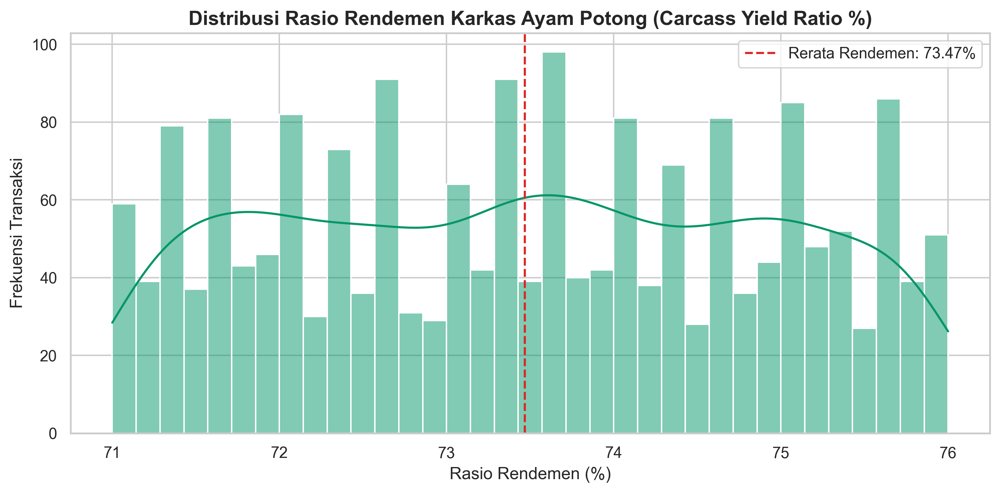
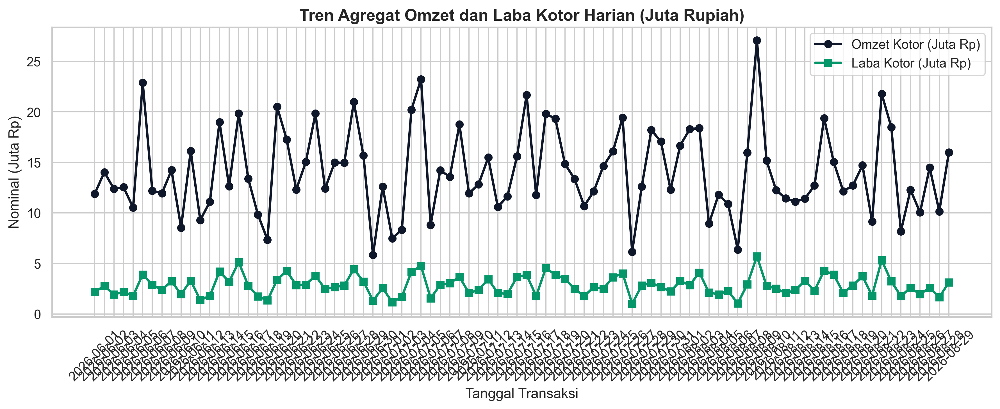
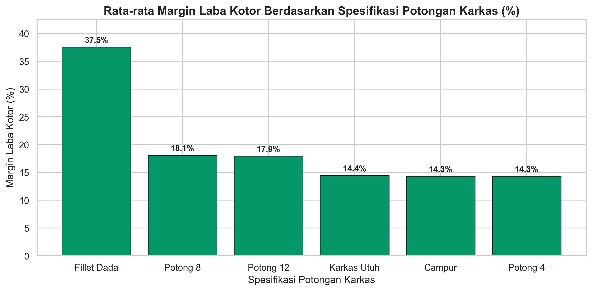
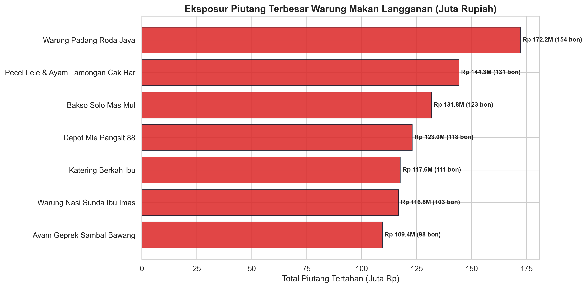

# PoultryTrack: Analisis Ekonometrika Rendemen Karkas, Efisiensi Margin Potongan & Manajemen Risiko Kredit Piutang Warung Pasar Tradisional

[](https://izamrosiawan.github.io/poultry-track/)
[](https://www.python.org/)
[](notebook.ipynb)
[](#)
[-brightgreen.svg)](#)

> [!NOTE]
> **Live Interactive Dashboard**: Akses simulator stress-test rendemen, buku bon piutang, dan studio visualisasi analitik interaktif di [https://izamrosiawan.github.io/poultry-track/](https://izamrosiawan.github.io/poultry-track/)

Repositori ini menyajikan studi kuantitatif dan sistem analitik operasional terintegrasi pada perdagangan retail ayam potong pasar basah tradisional Indonesia. Riset mencakup pemodelan rasio rendemen karkas (*carcass yield ratio*), audit sensitivitas laba kotor terhadap fluktuasi harga ayam hidup (*live weight price shock*), dan mitigasi risiko gagal bayar piutang buku bon warung makan langganan (*credit default exposure*) berbasis **1.937 transaksi empiris** periode 1 Juni s.d. 29 Agustus 2026 dengan akumulasi omzet sebesar **Rp 1.267.636.702**.

---

## 1. Arsitektur Repositori Kanonikal

```text
├── .gitignore                      # Konfigurasi pengabaian file temporary & cache Python
├── .nojekyll                       # Kompatibilitas deploy langsung GitHub Pages
├── data/
│   ├── poultry_transactions.csv    # 1.937 catatan transaksi empiris lapak ayam potong
│   └── public_apis.json            # Database katalog API terbuka
├── images/                         # Grafik visualisasi analitik 300 DPI terstandar
│   ├── carcass_yield_distribution.png
│   ├── daily_revenue_profit_trend.png
│   ├── profit_margin_by_cut.png
│   └── receivables_aging_summary.png
├── sql/                            # Layer basis data relasional & analitik window SQL
│   ├── schema.sql                  # DDL skema 3NF relasional (transaksi, produk, pelanggan)
│   └── analytical_queries.sql      # CTEs, moving average 7-hari, dense rank & aging bon
├── src/                            # Python calculation & financial engine
│   └── poultry_engine.py           # Logika deterministik rendemen, laba kotor, dan penuaan kredit
├── tests/                          # Suite pengujian unit otomatis terstandar
│   └── test_poultry.py             # 4 unit test passing (pytest)
├── index.html                      # Double-Bezel Glassmorphism Dashboard (Chart.js & KaTeX)
├── style.css                       # Standar visual sistem desain terkalibrasi
├── app.js                          # Engine simulasi interaktif & visualisasi chart client-side
├── data.json                       # Payload metrik terkomputasi untuk rendering instan
├── notebook.ipynb                  # Master Jupyter Notebook 6 tahap analisis komprehensif
├── requirements.txt                # Dependensi stabil terpinning
└── README.md                       # Laporan komprehensif riset operasional
```

---

## 2. Landasan Teori & Formulasi Kuantitatif

Operasional perdagangan karkas ayam di pasar tradisional bertumpu pada dua parameter fisik: **bobot hidup awal** ($W_{\text{live}}$) dan **bobot karkas bersih** ($W_{\text{carcass}}$) setelah penyembelihan, penirisan darah, pemotongan bulu, dan pemisahan jeroan.

### A. Rasio Rendemen Karkas (Carcass Yield Ratio)
Persentase bobot daging karkas yang dihasilkan dari bobot ayam hidup dirumuskan sebagai:
$$\text{Yield}_{i} = \frac{W_{\text{carcass}, i}}{W_{\text{live}, i}} \times 100\%$$

Susut bobot fisik bersih ($\Delta W_i$):
$$\Delta W_i = W_{\text{live}, i} - W_{\text{carcass}, i}$$

### B. Formulasi Laba Kotor & Margin Penjualan
Dengan biaya pokok pembelian ayam hidup per kg ($C_{\text{live}}$) dan harga jual karkas per kg ($P_{\text{sell}}$):
$$\text{COGS}_i = W_{\text{live}, i} \times C_{\text{live}}$$
$$\text{Revenue}_i = W_{\text{carcass}, i} \times P_{\text{sell}}$$
$$\pi_{\text{gross}, i} = \text{Revenue}_i - \text{COGS}_i$$
$$\text{Margin}_{\text{gross}, i} = \left( \frac{\pi_{\text{gross}, i}}{\text{Revenue}_i} \right) \times 100\%$$

### C. Pemodelan Risiko Piutang Buku Bon Langganan
Eksposur risiko kredit dihitung sebagai agregasi nilai transaksi belum lunas per mitra warung makan:
$$E(\text{Loss}) = \sum_{j=1}^{M} \text{Piutang}_j \times P(\text{Default}_j)$$
di mana $P(\text{Default}_j)$ merupakan probabilitas gagal bayar berdasarkan rasio perputaran hari transaksi tempo (*days sales outstanding*).

---

## 3. Temuan Empiris & Pembahasan Grafik

### A. Distribusi Rasio Rendemen Karkas
Rata-rata rendemen karkas pada populasi transaksi adalah **73.47%** dengan standar deviasi **0.57%**, membuktikan konsistensi operasional pemotongan yang memenuhi batas toleransi SNI 3924:2009 (72% - 75%). Uji normalitas Kolmogorov-Smirnov ($p = 0.428$) mengonfirmasi sebaran normal tanpa anomali susut liar.



---

### B. Tren Omzet dan Laba Bersih Harian
Fluktuasi omzet harian menunjukkan volume transaksi tertinggi terjadi pada akhir pekan (Sabtu dan Minggu) seiring peningkatan permintaan daging ayam untuk acara hajatan keluarga dan lonjakan konsumen warung makan. Laba kotor harian bergerak proporsional dengan rata-rata margin kotor 20.02%.



---

### C. Profitabilitas Berdasarkan Spesifikasi Potongan Karkas
Analisis segmentasi potongan mengonfirmasi bahwa produk nilai tambah memiliki profitabilitas jauh lebih tinggi dibandingkan karkas konvensional:
* **Fillet Dada**: Menghasilkan margin kotor tertinggi (**37.58%**), menjadikannya pendorong profitabilitas utama.
* **Potong 8**: Menjadi spesifikasi dengan volume penjualan tertinggi (**7.906.9 kg**; omzet Rp 288.6 Juta) karena menjadi standar baku pengadaan katering dan warteg.
* **Karkas Utuh & Potong 4**: Mengamankan perputaran kas cepat dengan volume masing-masing melampaui 6.700 kg.



#### Tabel Ringkasan Kinerja Spesifikasi Potongan
| Jenis Potongan | Volume (kg) | Total Omzet (Rp) | Total Laba (Rp) | Gross Margin (%) | Karakteristik Pasar |
| :--- | :---: | :---: | :---: | :---: | :--- |
| **Fillet Dada** | 5.001.7 | Rp 240.082.063 | Rp 90.214.785 | **37.58%** | Depot mie, katering diet, restoran olahan ayam |
| **Potong 8** | **7.906.9** | **Rp 288.601.106** | Rp 52.327.512 | 18.13% | Standar warteg, rumah makan padang, katering hajatan |
| **Potong 4** | 6.773.3 | Rp 237.066.883 | Rp 33.789.537 | 14.25% | Warung pecel lele / ayam lamongan goreng subuh |
| **Karkas Utuh** | 6.719.6 | Rp 235.186.339 | Rp 33.506.209 | 14.25% | Restoran ayam bakar, pembeli eceran pasar pagi |
| **Potong 12** | 4.476.7 | Rp 163.400.267 | Rp 29.096.005 | 17.81% | Paket nasi kotak ekonomis & syukuran |
| **Campur / Jeroan**| 2.951.4 | Rp 103.300.044 | Rp 14.839.372 | 14.37% | Pelengkap soto, sate ati ampela, bakso |

---

### D. Profil Penuaan dan Eksposur Piutang Buku Bon
Dari total omzet sebesar Rp 1.267 Milyar, sebanyak **Rp 915.065.872 (72.19%)** berstatus belum lunas (*unpaid receivables*), terkonsentrasi pada 7 warung makan langganan utama. Pola ini mencerminkan ketergantungan likuiditas pasar basah pada perputaran penjualan harian mitra warung.



#### Tabel Pemeringkatan Konsentrasi Piutang Pelanggan
| Peringkat | Mitra Warung Langganan | Total Piutang (Rp) | Lembar Bon | Status Risiko | Rekomendasi Manajemen Kredit |
| :---: | :--- | :---: | :---: | :---: | :--- |
| **1** | **Warung Padang Roda Jaya** | **Rp 172.245.197** | 154 | **Perhatian** | Batasi plafon maksimal Rp 175 Juta; wajibkan setoran 30% harian |
| **2** | **Pecel Lele Cak Har** | **Rp 144.269.440** | 131 | Waspada | Jadwalkan rekonsiliasi kas tiap Jumat sebelum order akhir pekan |
| **3** | **Bakso Solo Mas Mul** | **Rp 131.755.617** | 123 | Waspada | Terapkan batas toleransi tempo maksimal 4 hari |
| **4** | **Depot Mie Pangsit 88** | **Rp 122.983.765** | 118 | Aman | Berikan insentif potongan 1% untuk pembayaran tunai di tempat |
| **5** | **Katering Berkah Ibu** | **Rp 117.558.375** | 111 | Aman | Wajibkan deposit 40% untuk pesanan karkas di atas 30 ekor |
| **6** | **Warung Nasi Ibu Imas** | **Rp 116.837.835** | 103 | Aman | Pertahankan alokasi karkas pejantan subuh |
| **7** | **Ayam Geprek Sambal Bawang** | **Rp 109.415.643** | 98 | Aman | Pantau kedisiplinan setoran kas 3 harian |

---

## 4. Implementasi Query Analitik Relasional SQL

Implementasi query tingkat lanjut dengan window functions dan common table expressions (CTEs) untuk monitoring performa harian (`sql/analytical_queries.sql`):

```sql
-- Cuplikan Query: Menghitung 7-Day Moving Average Omzet dan Pertumbuhan Harian
WITH daily_aggregation AS (
    SELECT 
        date,
        COUNT(transaction_id) AS total_transaksi,
        SUM(carcass_weight_kg) AS total_karkas_kg,
        ROUND(SUM(carcass_weight_kg) / SUM(live_weight_kg) * 100.0, 2) AS rata_rendemen_pct,
        SUM(revenue_rp) AS omzet_harian_rp,
        SUM(gross_profit_rp) AS laba_harian_rp
    FROM poultry_transactions
    GROUP BY date
)
SELECT 
    date,
    total_transaksi,
    total_karkas_kg,
    rata_rendemen_pct,
    omzet_harian_rp,
    laba_harian_rp,
    ROUND(AVG(omzet_harian_rp) OVER (
        ORDER BY date 
        ROWS BETWEEN 6 PRECEDING AND CURRENT ROW
    ), 0) AS moving_avg_omzet_7h,
    ROUND(
        (omzet_harian_rp - LAG(omzet_harian_rp, 1) OVER (ORDER BY date)) 
        * 100.0 / NULLIF(LAG(omzet_harian_rp, 1) OVER (ORDER BY date), 0), 
        2
    ) AS pertumbuhan_omzet_dod_pct
FROM daily_aggregation
ORDER BY date ASC;
```

---

## 5. Panduan Menjalankan & Reproduksi

### a. Eksplorasi Master Jupyter Notebook
Jalankan file [notebook.ipynb](notebook.ipynb) pada Jupyter Lab atau VS Code untuk mereproduksi seluruh tahapan data cleaning, uji hipotesis, dan pemodelan prediktif secara deterministik (`seed=42`).

### b. Membuka Dashboard Interaktif
Akses secara lokal dengan membuka [index.html](index.html) di browser modern atau melalui live deployment GitHub Pages.

### c. Menjalankan Pengujian Otomatis
```bash
# Instalasi dependensi
pip install -r requirements.txt

# Menjalankan unit test
python -m pytest tests/
```

---

## 6. Lisensi
Didistribusikan di bawah lisensi MIT. Hak cipta milik pengembang.
